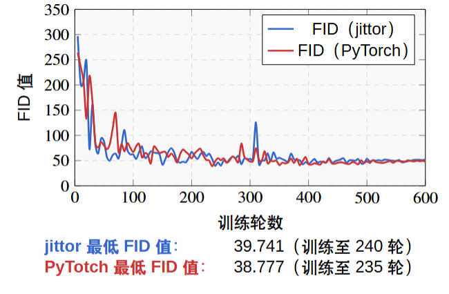
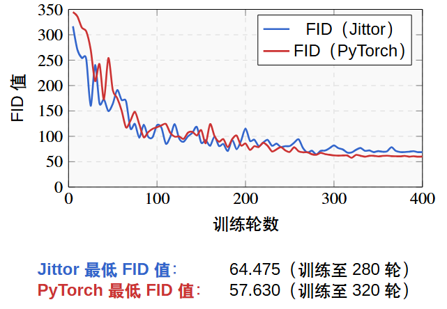
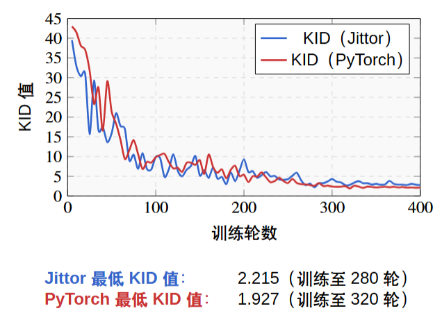
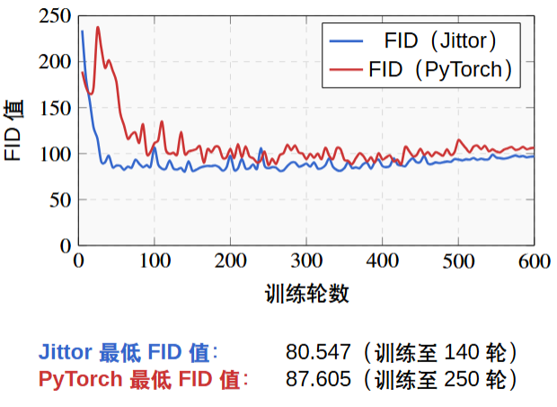
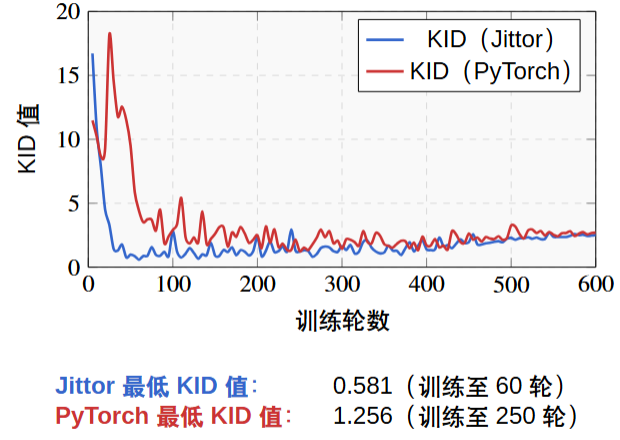

## 环境配置

本次实验复现使用的是 Jittor（计图）深度学习框架。

实验环境：WSL-Ubuntu 24.04 + conda + CUDA + Jittor

环境配置过程参照官方文档进行，中途遇到的问题大多可以通过官方论坛等渠道解决。总体而言，这是我目前配置难度最高的一个环境——网上可供参考的方案较少，且每个人遇到的错误也不尽相同，配置过程也是比较崩溃的。现在回想起来，虽然走了不少弯路，但这段经历也积累了宝贵的经验。

配置过程中遇到了一个问题是系统提示找不到 GPU 设备。由于没有 GPU 的话模型训练速度会极其缓慢，这个问题但是查找了很多办法，但是对于我的情况都是没有作用的。在始终无法定位问题根源的情况下，我决定直接尝试运行，结果发现程序实际上已经在使用 GPU，但是仍不清楚为何会持续显示找不到 GPU 设备。

## 数据集

数据集部分，我按照作者提供的 `.sh` 脚本从网络下载。由于算力有限，删减了部分图片，这对实验结果会产生一定影响。但个人认为，在这种条件下，Jittor 复现的结果已相当可观。

## 训练与测试命令

训练过程中偶尔会出现内存溢出的情况。由于模型每五个轮次保存一次参数，因此可以从上次保存的检查点继续训练，无需从头开始。

关于训练速度，个人感受是 PyTorch 比 Jittor 略快一些。

**训练命令：**
```bash
python train.py --dataroot=datasets/horse2zebra --direction=AtoB --lambda_path=0.05 --tag=santa_zebra --n_epochs=400 --batch_size=1 --gpu_ids=0
```

**测试命令：**
```bash
python test.py --dataroot datasets/horse2zebra --name santa_zebra --direction AtoB --epoch latest --gpu_ids 0 --no_dropout
```

## Jittor 与 PyTorch 训练结果对比

以下为在相同数据集、相同训练轮次条件下，Jittor 与 PyTorch 训练结果的 FID 与 KID 指标对比。

**horse2zebra 数据集：**




**label2city 数据集：**





**summer2winter 数据集：**





通过本次实验复现，结合网上部分开发者对计图框架的使用评价，深切感受到了国内自主开源深度学习框架的潜力与优秀。随着 Jittor 的持续发展与完善，或许会逐渐走向普及，并在某些特定领域展现出超越 PyTorch 的竞争力。